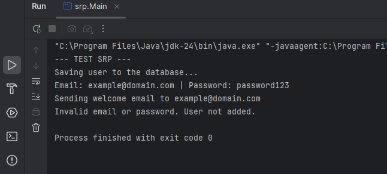
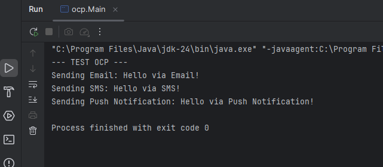
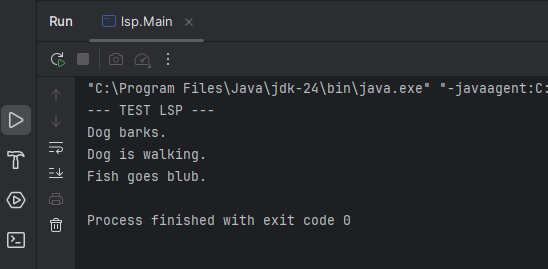
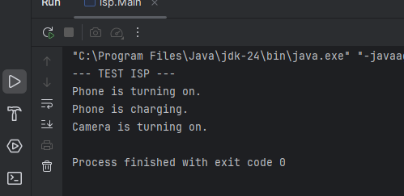
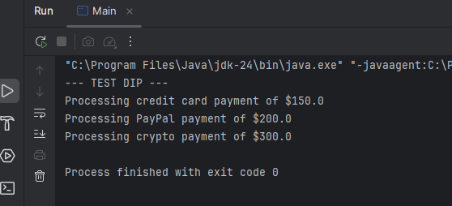

# SOLID Principles Refactoring - Comprehensive Implementation

**Author:** [byPronox](https://github.com/byPronox)

## Group Members

* Justin Gomezcoello
* Stefan Játiva
* Jhoel Suárez
* Mauricio Mora

---

## Project Description

This repository contains the technical refactoring of five Java modules to apply the five SOLID principles of object-oriented design. Each module starts from a common design problem and is refactored using abstractions, separation of responsibilities, polymorphism, interface segregation, and dependency injection.

The purpose of this project is to demonstrate how SOLID improves code maintainability, extensibility, testability, and architectural quality.

---

## Project Structure

```text
SOLID-Practice/
├── evidencias/
│   ├── srp-ejecucion.png
│   ├── ocp-ejecucion.png
│   ├── lsp-ejecucion.png
│   ├── isp-ejecucion.png
│   └── dip-ejecucion.png
├── src/
│   └── main/
│       └── java/
│           ├── srp/
│           ├── ocp/
│           ├── lsp/
│           ├── isp/
│           └── dip/
├── pom.xml
├── .gitignore
└── README.md
```

---

## Technologies Used

* Java
* Maven
* IntelliJ IDEA
* Git and GitHub

---

## How to Run the Project

Compile the project:

```bash
mvn clean compile
```

Run each SOLID principle example:

```bash
mvn exec:java -Dexec.mainClass=srp.Main
mvn exec:java -Dexec.mainClass=ocp.Main
mvn exec:java -Dexec.mainClass=lsp.Main
mvn exec:java -Dexec.mainClass=isp.Main
mvn exec:java -Dexec.mainClass=dip.Main
```

Each execution should finish with:

```text
Process finished with exit code 0
```

---

# English Section

## 1. Single Responsibility Principle (SRP)

### Architectural Problem

The original `UserManager` class had high coupling and low cohesion because it handled user validation, database persistence, and welcome notifications in the same class. This created multiple reasons for change and made the class harder to maintain and test.

### Technical Solution

The class was refactored by separating its responsibilities into independent and cohesive components:

* `UserValidator`: validates email and password rules.
* `UserRepository`: simulates user persistence.
* `NotificationService`: sends the welcome notification.
* `UserManager`: coordinates the workflow without assuming all responsibilities.

This design applies separation of concerns and ensures that each class has a single reason to change.

### Reflection

Applying SRP improves modularity and reduces the risk of side effects. If the validation rules change, only `UserValidator` must be modified. If the persistence mechanism changes, only `UserRepository` is affected. This makes the system easier to test, maintain, and extend.

### Execution Evidence



---

## 2. Open/Closed Principle (OCP)

### Architectural Problem

The original notification flow depended on rigid `if/else` blocks to decide the notification type. Every time a new channel was added, the existing service had to be modified, increasing the risk of regression errors.

### Technical Solution

The refactoring introduced the `Notification` interface. Each notification channel is now implemented in its own class:

* `EmailNotification`
* `SMSNotification`
* `PushNotification`

The `NotificationService` depends on the abstraction and delegates the behavior to the concrete implementation. This allows new notification types to be added without modifying the existing service.

### Reflection

OCP is essential for long-term extensibility. The system is now open for extension because new notification channels can be added as new classes. At the same time, it is closed for modification because the already tested `NotificationService` does not need to be changed.

### Execution Evidence



---

## 3. Liskov Substitution Principle (LSP)

### Architectural Problem

The original model forced subclasses such as `Fish` to inherit a `walk()` method from the base `Animal` class. Since a fish cannot walk, the implementation produced an `UnsupportedOperationException`, breaking the expected behavior of the inheritance hierarchy.

### Technical Solution

The refactoring separated general animal behavior from specific movement capabilities. The base `Animal` class keeps the common behavior, while the `Walkable` interface is implemented only by animals that can actually walk, such as `Dog`.

This prevents subclasses from being forced to implement behavior that does not apply to them.

### Reflection

LSP ensures that derived classes can be used safely without breaking the behavior expected from their abstractions. This refactoring avoids runtime exceptions, reduces defensive programming, and creates a more accurate object-oriented model.

### Execution Evidence



---

## 4. Interface Segregation Principle (ISP)

### Architectural Problem

The original `Device` interface forced all devices to implement `turnOn()`, `turnOff()`, and `charge()`. This caused classes such as `DisposableCamera` to depend on a method that was not relevant to their behavior.

### Technical Solution

The large interface was divided into smaller and more specific interfaces:

* `Switchable`: for devices that can be turned on and off.
* `Chargeable`: for devices that can be charged.

Now, each class implements only the methods it actually needs. For example, `Phone` implements both `Switchable` and `Chargeable`, while `DisposableCamera` only implements `Switchable`.

### Reflection

ISP improves cohesion and prevents classes from depending on unnecessary methods. This produces cleaner interfaces, avoids dummy implementations, and makes the code easier to understand, maintain, and test.

### Execution Evidence



---

## 5. Dependency Inversion Principle (DIP)

### Architectural Problem

The original `PaymentProcessor` depended directly on the concrete class `CreditCardPayment`. This tightly coupled the high-level payment processor to a low-level implementation and made it difficult to add new payment methods.

### Technical Solution

The refactoring introduced the `PaymentMethod` abstraction. The `PaymentProcessor` now receives a `PaymentMethod` through constructor dependency injection. Concrete implementations such as `CreditCardPayment`, `PayPalPayment`, and `CryptoPayment` depend on the same abstraction.

This fully decouples the payment processor from specific payment methods.

### Reflection

DIP is fundamental for scalable architectures. By depending on abstractions instead of concrete implementations, the system becomes flexible and easier to extend. New payment methods can be added without rewriting the core processing logic.

### Execution Evidence



---

# Sección en Español

## 1. Principio de Responsabilidad Única (SRP)

### Problema Arquitectónico

La clase original `UserManager` tenía alto acoplamiento y baja cohesión porque gestionaba validación de usuarios, persistencia de datos y envío de notificaciones dentro de una misma clase. Esto generaba múltiples razones de cambio y dificultaba el mantenimiento.

### Solución Técnica

Se separaron las responsabilidades en clases independientes:

* `UserValidator`: valida el correo y la contraseña.
* `UserRepository`: simula el almacenamiento del usuario.
* `NotificationService`: envía la notificación de bienvenida.
* `UserManager`: coordina el flujo sin concentrar toda la lógica.

Con esto, cada clase tiene una responsabilidad clara y una única razón para cambiar.

### Reflexión

SRP mejora la modularidad y reduce el impacto de los cambios. Si cambia la validación, solo se modifica `UserValidator`; si cambia la persistencia, solo se modifica `UserRepository`. Esto facilita el mantenimiento, la comprensión del código y la creación de pruebas unitarias.

### Evidencia de Ejecución


---

## 2. Principio Abierto/Cerrado (OCP)

### Problema Arquitectónico

El flujo original de notificaciones dependía de condicionales `if/else` para determinar el tipo de mensaje. Esto obligaba a modificar la clase principal cada vez que se requería un nuevo canal de notificación.

### Solución Técnica

Se implementó la interfaz `Notification`, y cada tipo de notificación fue encapsulado en su propia clase:

* `EmailNotification`
* `SMSNotification`
* `PushNotification`

La clase `NotificationService` trabaja con la abstracción y delega el comportamiento a cada implementación concreta.

### Reflexión

OCP permite extender el sistema sin modificar código existente. Ahora, para agregar un nuevo canal, solo se crea una nueva clase que implemente `Notification`. Esto reduce errores de regresión y protege la lógica ya probada.

### Evidencia de Ejecución


---

## 3. Principio de Sustitución de Liskov (LSP)

### Problema Arquitectónico

La clase `Fish` heredaba de `Animal` un método `walk()` que no podía cumplir correctamente, generando una excepción en tiempo de ejecución. Esto rompía el contrato de la clase base y evidenciaba un problema de diseño en la jerarquía.

### Solución Técnica

Se separó el comportamiento general de los animales de las capacidades específicas de movimiento. La clase base `Animal` conserva el comportamiento común, mientras que la interfaz `Walkable` es implementada únicamente por animales que pueden caminar, como `Dog`.

### Reflexión

LSP garantiza que las subclases puedan utilizarse sin romper el comportamiento esperado del programa. Esta refactorización elimina excepciones innecesarias y permite una jerarquía más coherente con el dominio del problema.

### Evidencia de Ejecución


---

## 4. Principio de Segregación de Interfaces (ISP)

### Problema Arquitectónico

La interfaz `Device` obligaba a todos los dispositivos a implementar métodos que no necesariamente necesitaban. Por ejemplo, `DisposableCamera` se veía forzada a implementar `charge()`, aunque no es un dispositivo recargable.

### Solución Técnica

Se dividió la interfaz general en contratos más pequeños:

* `Switchable`: para dispositivos que pueden encenderse y apagarse.
* `Chargeable`: para dispositivos que pueden cargarse.

De esta forma, `Phone` implementa ambos contratos, mientras que `DisposableCamera` solo implementa `Switchable`.

### Reflexión

ISP evita interfaces demasiado grandes y reduce dependencias innecesarias. El código se vuelve más claro, modular y fácil de probar, ya que cada clase depende únicamente de los métodos que realmente utiliza.

### Evidencia de Ejecución


---

## 5. Principio de Inversión de Dependencias (DIP)

### Problema Arquitectónico

El módulo de alto nivel `PaymentProcessor` dependía directamente de `CreditCardPayment`, una implementación concreta de bajo nivel. Esto hacía que el sistema fuera rígido y difícil de ampliar con nuevos métodos de pago.

### Solución Técnica

Se creó la interfaz `PaymentMethod`, y el procesador de pagos recibe esta abstracción mediante inyección de dependencias por constructor. Las implementaciones concretas son:

* `CreditCardPayment`
* `PayPalPayment`
* `CryptoPayment`

Ahora, tanto el módulo de alto nivel como los módulos de bajo nivel dependen de una abstracción.

### Reflexión

DIP permite construir sistemas desacoplados y escalables. El procesador puede trabajar con distintos métodos de pago sin cambiar su lógica interna. Esto facilita la extensión del sistema y reduce el riesgo de errores al incorporar nuevas funcionalidades.

### Evidencia de Ejecución


---

## Final Conclusion

The application of the five SOLID principles improved the structure and quality of the project. The refactored code is more modular, easier to understand, easier to test, and better prepared for future changes. Each principle solved a specific design problem, but together they contributed to a cleaner and more maintainable object-oriented architecture.

## Conclusión Final

La aplicación de los cinco principios SOLID permitió mejorar la estructura y calidad del proyecto. El código refactorizado es más modular, comprensible, fácil de probar y preparado para cambios futuros. Cada principio resolvió un problema específico de diseño, pero en conjunto contribuyeron a una arquitectura orientada a objetos más limpia y mantenible.
